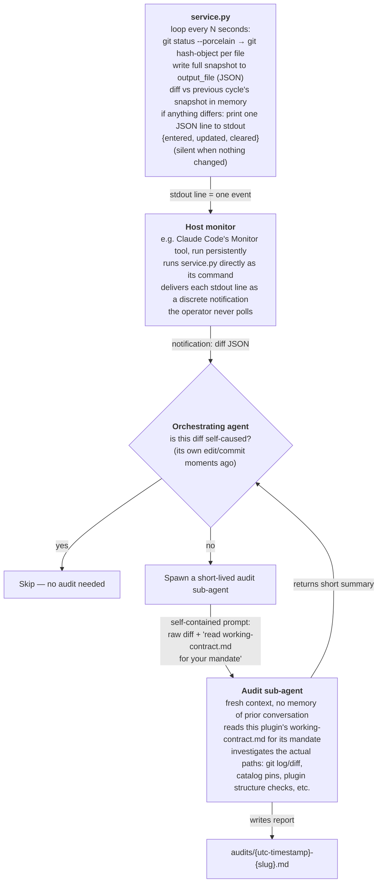

# catalyst-git

Repository plugin for Git-based workflows.

## Continuous auditing architecture

The plugin's continuous-auditing responsibility (see `working-contract.md`)
is implemented as an event-driven pipeline, not a manual polling loop.

**`service.py`'s `repo_path` argument must always be the deployed project's
own root directory** — the project this plugin was activated within,
resolved at activation time. Never point it at the catalyst framework's own
repository and never at this plugin's own installation directory under
`plugins/<type>/catalyst-git/`; either mistake monitors the wrong project
entirely and produces audits with no relevance to the deployment.

Two file categories matter here:

- **Ephemeral**: the snapshot file `service.py` writes every cycle is just
  its own before/after cache, rebuilt from `git status` on every run.
  Deleting it does nothing — the next cycle regenerates it — and it's not
  meant to live in any repository.
- **Durable**: everything under the root-level `audits/` folder is the
  plugin's actual audit trail — one markdown report per real change-set
  investigated, meant to persist and be committed alongside the project.

The key design choice is the **self-caused-event filter**: the same agent
that edits framework files also receives the change notifications, so it
recognizes its own commits and only spends a sub-agent's budget on changes
it didn't just make itself — otherwise every edit would trigger a redundant
audit of itself.
